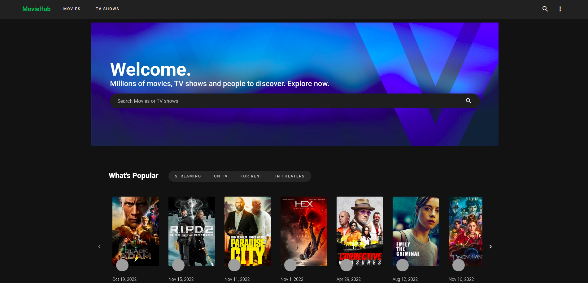
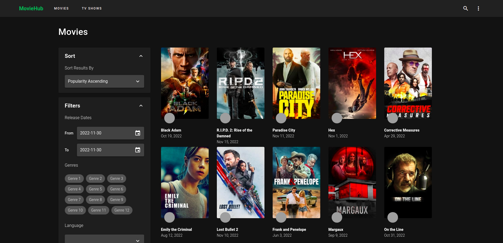
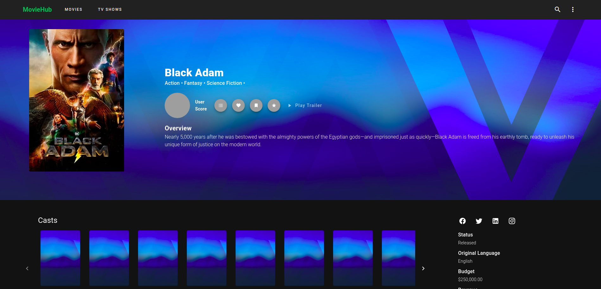
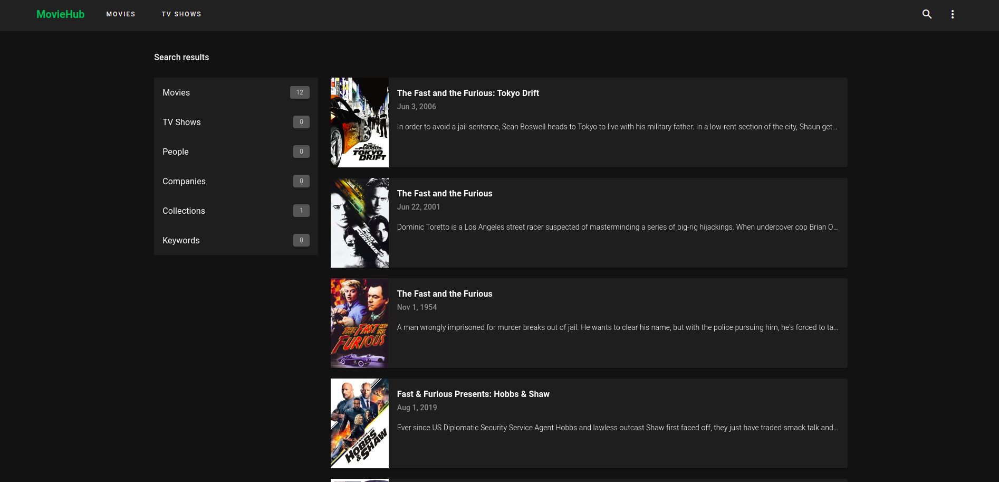

# moviehub-nuxt-vuetify

<!-- WEBSITE SCREENSHOT -->





## Integration with moviedb api
* Create account on https://www.themoviedb.org
* Log in to your moviedb account and go to https://www.themoviedb.org/settings/api to get your api key
* Copy and paste .env.example.js to project root directory and rename it to .env.js
* Paste this 'https://api.themoviedb.org' to .env.js apiDomain variable and paste your api key to  apiKey variable

## Build Setup

```bash
# install dependencies
$ npm install

# serve with hot reload at localhost:3000
$ npm run dev

# build for production and launch server
$ npm run build
$ npm run start

# generate static project
$ npm run generate
```